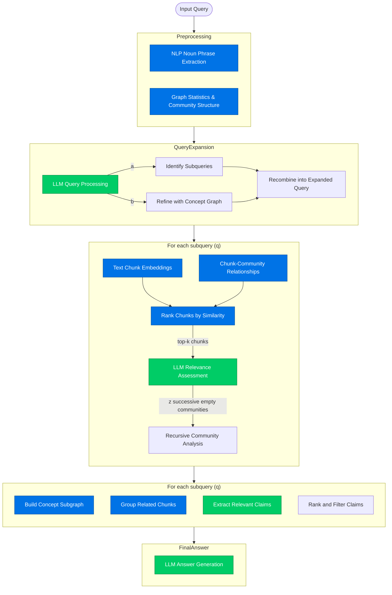

# LLM_Pruning
Contains the sample scripts for doing Pruning in LLMs

```mermaid
flowchart TD
    Start([Input Query])
    
    subgraph Preprocessing
        NLP[NLP Noun Phrase Extraction]
        Graph[Graph Statistics & Community Structure]
    end
    
    subgraph QueryExpansion
        LLM1[LLM Query Processing]
        LLM1 --> |a| SubQ[Identify Subqueries]
        LLM1 --> |b| Refine[Refine with Concept Graph]
        SubQ --> Combine[Recombine into Expanded Query]
        Refine --> Combine
    end
    
    subgraph ChunkProcessing["For each subquery (q)"]
        direction TB
        Embed[Text Chunk Embeddings]
        Rank1[Rank Chunks by Similarity]
        Community[Chunk-Community Relationships]
        Assess[LLM Relevance Assessment]
        Recurse[Recursive Community Analysis]
        
        Embed --> Rank1
        Community --> Rank1
        Rank1 --> |top-k chunks| Assess
        Assess --> |z successive empty communities| Recurse
    end
    
    subgraph ClaimExtraction["For each subquery (q)"]
        direction TB
        Build[Build Concept Subgraph]
        Group[Group Related Chunks]
        Extract[Extract Relevant Claims]
        RankFilter[Rank and Filter Claims]
    end
    
    subgraph FinalAnswer
        Answer[LLM Answer Generation]
    end
    
    Start --> Preprocessing
    Preprocessing --> QueryExpansion
    QueryExpansion --> ChunkProcessing
    ChunkProcessing --> ClaimExtraction
    ClaimExtraction --> FinalAnswer
    
    %% Styling
    classDef process fill:#0073e6,stroke:#004d99,color:#fff
    classDef llm fill:#00cc66,stroke:#008040,color:#fff
    
    class NLP,Graph,Embed,Rank1,Community,Build,Group process
    class LLM1,Assess,Extract,Answer llm
```
